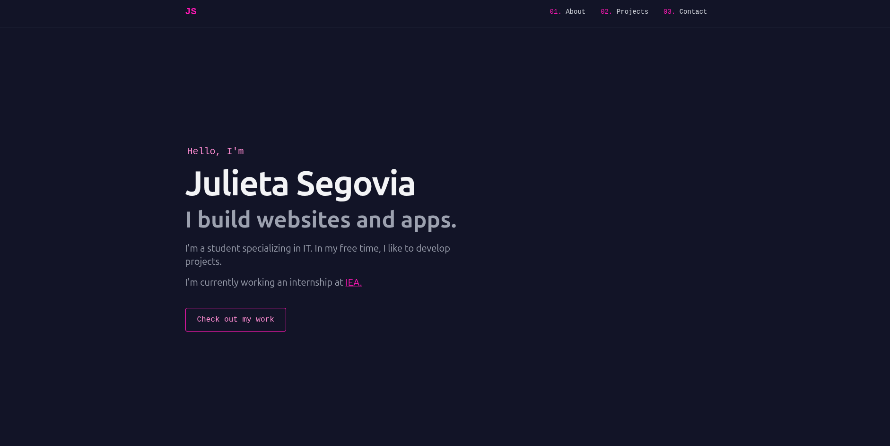

# Simple Portfolio
Welcome to my own personal page! This portfolio was built purely with HTML and Tailwind CSS. It consists of a home page, a header to jump to each section of the portfolio and 3 sections total.

#### The Home Page
Just a simple introduction to who I am and what I do. It has a link to my current workspace's page and a button that jumps straight to my projects.

#### Section 1 - About Me
A more extended introduction with more of who I am, where I study and a list of languages and frameworks I'm familiar with. I also added a photo of myself with a little frme and animations.

#### Section 2 - My Projects
Here I present four of my favorite projects with a short description of what it is what tools I used to build it. I also added two buttons, one to check the live demo and one to check the source repo. Both this buttons are animated.

#### Section 3 - My Contact
With animated sgv icons I added my socials for contact. Under this I added a little footer that indicates that this website was designed by me.